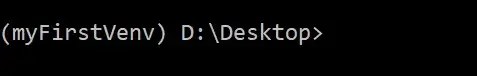

# Робота з ***virtualenvwrapper-win*** та керування віртуальними оточеннями

## Установка
потрібно установити два модуля які використовуються для цих цілей
- virtualenv
- virtualenvwrapper-win

```Batchfile
pip install virtualenv
pip install virtualenvwrapper-win
```
virtualenvwrapper-win уже містить virtualenv, але бажано встановити їх окремо
> для Unix замість virtualenvwrapper-win слід використати virtualenvwrapper

## Використання Virtualenv
Уже встановленої virtualenv, достатньо щоб працювати із ВО. 

1. Щоб створити ВО - виконайте таку команду, в папці де знаходиться ваш проект для якого створюється ВО:
```Batchfile
virtualenv ENV_NAME
```
> де ENV_NAME ім'я яке ви хочете присвоїти цьому ВО, наприклад:
```Batchfile
virtualenv myFirstVenv
```
створить папку яка зветься myFirstVenv і яка буде містити віртуальну версію Python. 

2. Для активацйії цього ВО, виконати:
```Batchfile
.\ENV_NAME\Scripts\activate
```
або для Unix:
```Batchfile
source ENV_NAME\bin\activate
```
Ваш рядок термінала зміниться і буде виглядати якось так:<br>
<br>
це значить, що зараз ви використовуєте віртуально виокремлене оточення під назвою **myFirstVenv** замість глобально установленої в системі версію Python.

3. Закінчити роботу з даним ВО, виконавши команду:
```Batchfile
deactivate
```

## Керування багатьмя ВО


